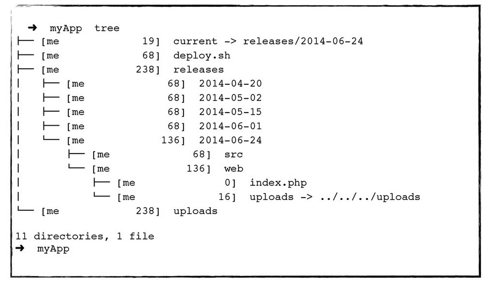

Deploy
======

Deployers: Shell scripts &amp; Makefiles to deploy web apps on a released-based dirs structure


## Deployment made simple

```bash
me@myserver$~: ./deploy.sh
```

Even better:

```bash
me@myserver$~: make install
me@myserver$~: make update
me@myserver$~: make check
me@myserver$~: make deploy
me@myserver$~: make rollback
```

Now everyone in your team can deploy. And rollback.



### Simple philosophy

- Keep the deployement simple & fast.
- Use Make, available on UNIX / GNU Linux / FreeBSD / Mac OS X
- Change your rules & tools, freely (switch from Grunt to Gulp to Whatever.js") without changing your deployement command: just `make deploy`.
- Rollbacking is as simple as deploying: `make rollback`
- In case of doubt: `make help`

### Related

- [An introduction to GNU Make](http://www.gnu.org/software/make/manual/make.html#Introduction)

### LICENSE

MIT
